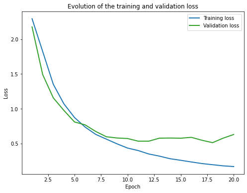
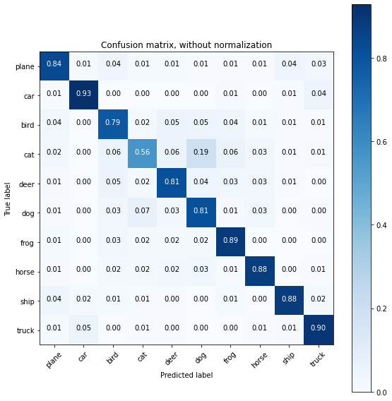

# Lab2 Image Mining

## - Deep Learning with PyTorch: CIFAR10 object classification

By Jiangnan HUANG & Thomas SU - 21/10/2020

Instructor: Gianni Franchi, Antoine Manzanera

Here is [*our notebook*](https://github.com/JiangnanH/ImageMining/blob/master/Lab2/Copy_of_PyTorch_cifar10_tutorial_ROB313_2020.ipynb).

### 1. Explain the neural networks and hyper parameters configurations we tested and the resulting performances and trade-offs found.

**Neural networks:**

We test CNN based model with different structures.

- kernel size;
- number of feature maps;
- number of convolutional layers;
- size of fully connected layers;
- use dropout or not(also number of dropout layers);

**Hyper parameters:**

- batch size: we test batch_size = 32, 64, 128, 256, 512. With small batch size(batch_size = 32), the algorithm converges quicker but the result on the test set is not very good. With bigger batch size, the algorithm converges slower, and the best result is obtained with batch_size = 64.
- learning rate: we test learning rate = 0.0001, 0.001, 0.01. Small lr -> converge slowly, easily become overfitting; Big lr-> can not even converge, underfitting. The best lr tested is 0.001.
- number of epochs: this term is almost depended on the two hyper parameters above. As in the provided training function, the parameters of the network which obtained the best performance on validation set is kept as the final network's parameters, the learning rate should then be big enough to get the smallest loss on validation set.
- size of the training set/validation set

### 2. What is happening when the training and test losses start diverging?
- When the training loss diverging: learning rate too big, the network can not converge.
- When test(or validation) loss diverging: overfitting.
Then we have to find the right learning rate so that these problems do not arise.

### 3. Top performing configurations:

**Network structure:**

$[CNN+relu+CNN+relu+Maxpooling]\times3+FC+relu+dropout+FC+relu+FC$ (see more details in our notebook)

- Number of convolutional layers: $6$

- Kernel size for all CNN layers: $3\times3$

- Number of feature maps: $from \ 32 \ to \ 64 \ to \ 128 \ to \ 256$

- Number of Maxpooling layers: $6$

- Number of Fully connected layers: $3$

- Number of Fully connected layers: $from \ 256*4*4 \ to \ 256 \ to \ 64 \ to \ 10$

- Number of Dropout layers: $1$

**Hyper parameters:**

- Learning rate: 0.01

- batch size: 64

- Number of epochs: 20

- size of the training set: 49000

- size of the validation set: 1000

**Other configurations:**

- Optimizer: SGD with momentum = 0.9, lr = learning rate

- Apply data augmentation for train and validation set by using: transforms.RandomHorizontalFlip(), transforms.RandomGrayscale();

**Result: (best performance)**

- Accuracies:

  Accuracy of the network on the 49000 train images: 95.12 %

  Accuracy of the network on the 1000 validation images: 83.30 %

  Accuracy of the network on the 10000 test images: 82.94 %

- Plot of losses:

- Normalized confusion matrix:

### 3.1 Interpretation on the losses plot

### 3.2 Potential improvements

- fix the overfitting problem
- play on other parameters of the CNN : stride, padding, atrous (we did not focus on these parameters because the size of our image is relatively small).
